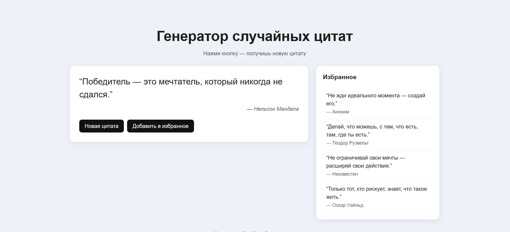

# Генератор случайных цитат

Простое React‑приложение, позволяющее генерировать случайные цитаты по кнопке, а также сохранять понравившиеся цитаты в список избранного. 

## 📌 Основные возможности
- Получение случайной цитаты
- Отображение автора
- Кнопка для добавления цитаты в избранное
- Список избранных цитат сбоку
- Сохранение избранного в `localStorage`, чтобы данные не пропадали при перезагрузке страницы

## 🛠 Особенности реализации
- Использованы функциональные компоненты React
- Управление состоянием через `useState`
- Сохранение и загрузка данных через `useEffect` и `localStorage`
- Адаптивная вёрстка: основной блок не растягивается от увеличения списка избранного

## 🖼 Скриншот приложения

## ✔ Выводы
В ходе выполнения контрольной работы было создано React‑приложение, демонстрирующее работу с компонентами, событиями, состоянием и локальным хранилищем. Реализована базовая архитектура и простая адаптивная вёрстка. Работа соответствует требованиям задания.
